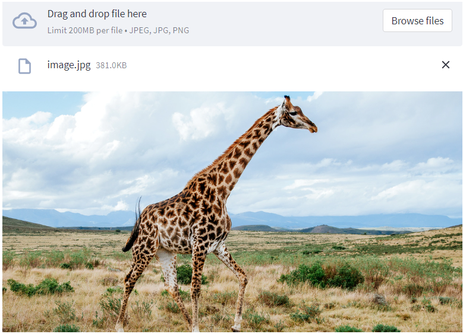

# Ask Question to Image Web App with Streamlit and LangChain




This is a Streamlit application that allows users to ask questions about an uploaded image and receive responses from a conversational AI agent. The agent uses the OpenAI GPT-3.5 Turbo model to generate answers based on the provided image and user input.

## Installation

1. Clone the repository:

   ```shell
   git clone https://github.com/Elhassnaoui2001/Chat-with-an-Image.git


## Usage

1. **Upload an image** by clicking the file upload button.

2. The uploaded image will be displayed.

3. **Enter a question** about the image in the text input field.

4. The conversational AI agent will generate a response based on the provided question and image.

5. The response will be displayed below the question input.

## Tools

The application utilizes the following custom tools:

- **ImageCaptionTool**: Generates a textual caption for the uploaded image.
- **ObjectDetectionTool**: Performs object detection on the uploaded image and identifies the objects present.

## Contributing

Contributions are welcome! If you have any ideas, improvements, or bug fixes, please submit a pull request.


## Acknowledgements

- This project uses the OpenAI GPT-3.5 Turbo model. Visit [OpenAI](https://openai.com) for more information.
- The Streamlit library is used for building the interactive user interface. Visit the [Streamlit documentation](https://docs.streamlit.io) for more information.
- The LangChain library is used for managing the conversational AI agent and tools. Visit the [LangChain GitHub repository](https://github.com/langchain/langchain) for more information.
- The Transformers library is used to inference the AI features. Visit the [Transformers documentation](https://huggingface
